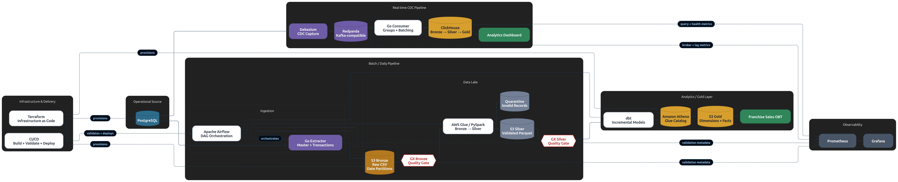
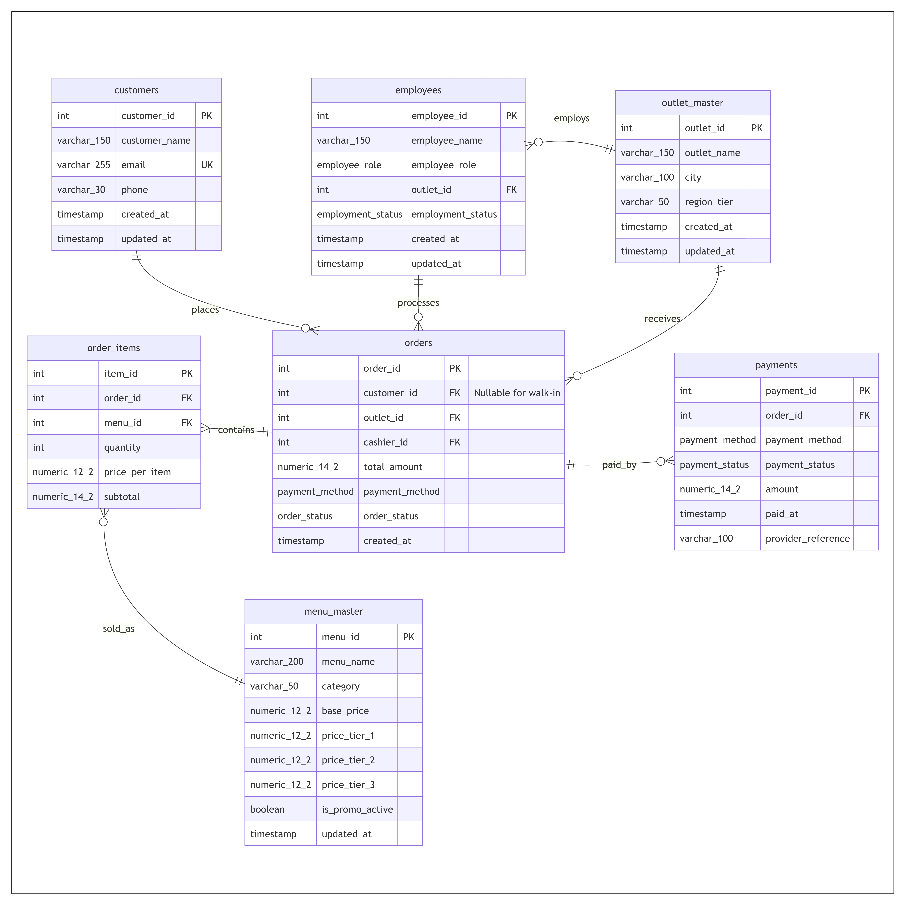
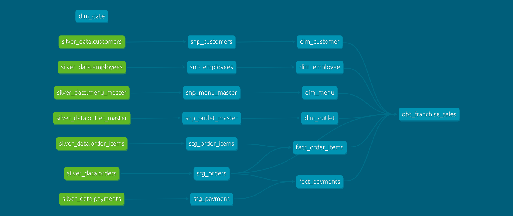
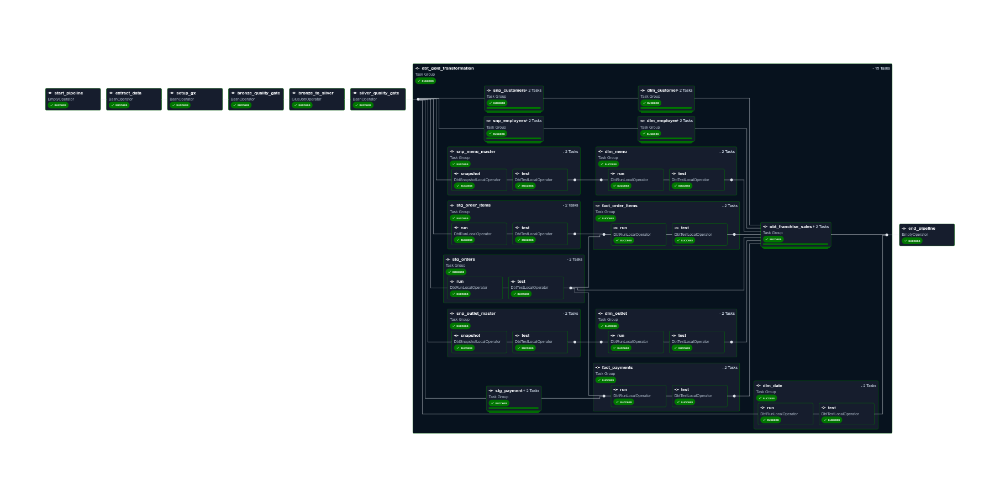

# Franchise Data Pipeline

> **End-to-end batch and real-time data platform for franchise restaurant transactions.**
> Batch: PostgreSQL -> S3 Bronze -> Glue/PySpark Silver -> dbt/Athena Gold.
> Real-time: PostgreSQL CDC -> Debezium -> Redpanda -> Go consumer -> ClickHouse.

---

## Tech Stack


---

## Pipeline Architecture



The pipeline flows data through four layers:

| Layer | Location | Format | Description |
|---|---|---|---|
| **Source** | PostgreSQL (OLTP) | Tables | Operational source with customers, employees, orders, payments, and WAL-based replication |
| **Bronze** | S3: data-lake-bronze | CSV | Raw extracted data, partitioned by date for transaction tables |
| **Silver** | S3: data-lake-silver | Parquet | Cleaned and validated data with business rules applied via PySpark |
| **Gold** | S3: data-lake-gold | Parquet | Analytics-ready dimensions, facts, and serving OBT built by dbt |
| **Real-time** | Redpanda / ClickHouse | Events / analytical tables | CDC stream for low-latency analytics and dashboarding |

---

## Technology Stack

| Category | Technology | Purpose |
|---|---|---|
| **Database** | PostgreSQL 15 | Source OLTP database with primary-replica replication |
| **Extraction** | Go 1.21 | Custom binary reads replica and writes CSV to Bronze S3 |
| **Orchestration** | Apache Airflow 3.0 | Schedules and orchestrates the daily pipeline DAG |
| **Transformation** | AWS Glue (PySpark 3.5) | Bronze to Silver: cleansing, validation, quarantine, and idempotent partition overwrite |
| **Data Quality** | Great Expectations | Bronze and Silver quality gates with Data Docs and metadata tracking |
| **Analytics Modeling** | dbt 1.10 (Cosmos) | Staging, SCD Type 2 snapshots, dimensions, facts, and serving OBT |
| **Real-time CDC** | Debezium, Redpanda, Go, ClickHouse | CDC ingestion, consumer groups, analytical layers, and dashboarding |
| **Observability** | Grafana, Great Expectations metadata | Pipeline monitoring, data quality results, and dashboards |
| **Query Engine** | AWS Athena | Serverless SQL queries on Gold layer tables |
| **Infrastructure** | Terraform 1.11 | Provisions all AWS resources (S3, Glue, Athena, IAM) |
| **Containerization** | Docker / Compose | Local environment for Airflow, PostgreSQL, GX metadata, and Glue |


## AWS Infrastructure

All infrastructure is provisioned via Terraform (`infrastructure/environments/dev`).

### S3 Buckets

| Bucket | Purpose |
|---|---|
| `franchise-pipeline-dev-data-lake-bronze` | Raw CSV data from Go extractor |
| `franchise-pipeline-dev-data-lake-silver` | Cleaned Parquet data from Glue |
| `franchise-pipeline-dev-data-lake-gold` | Analytics-ready tables from dbt |
| `franchise-pipeline-dev-data-lake-quarantine` | Invalid or suspicious records |
| `franchise-pipeline-dev-athena-query-results` | Athena query output storage |
| `franchise-pipeline-dev-glue-scripts` | Glue job scripts and dependencies |
| `franchise-pipeline-dev-state-lock` | Terraform state lock |

### AWS Glue

| Resource | Name | Description |
|---|---|---|
| **Glue Job** | `franchise-pipeline-dev-bronze-to-silver` | PySpark job: reads Bronze CSV, validates, writes Silver Parquet |
| **IAM Role** | `franchise-pipeline-dev-glue-role` | Execution role with S3 and Glue permissions |

### AWS Athena

| Resource | Name |
|---|---|
| **Database** | `franchise_pipeline_dev_athena_db` |
| **Workgroup** | `franchise_pipeline_dev_workgroup` |
| **Tables** | `outlet_master`, `menu_master`, `customers`, `employees`, `orders`, `order_items`, `payments` |

### Glue Catalog Tables

| Table | Source Location | Format | Partitioned |
|---|---|---|---|
| `outlet_master` | `silver/outlet_master/` | Parquet | No |
| `menu_master` | `silver/menu_master/` | Parquet | No |
| `customers` | `silver/customers/` | Parquet | No |
| `employees` | `silver/employees/` | Parquet | No |
| `orders` | `silver/orders/` | Parquet | year, month, day |
| `order_items` | `silver/order_items/` | Parquet | year, month, day |
| `payments` | `silver/payments/` | Parquet | year, month, day |


## Database Schema (OLTP)



Refer to [`assets/struktur-oltp.mmd`](assets/struktur-oltp.mmd) and [`infrastructure/database/sql/SOURCE-SCHEMA_v2.sql`](infrastructure/database/sql/SOURCE-SCHEMA_v2.sql) for complete schema details.

The current OLTP schema contains `outlet_master`, `menu_master`, `customers`, `employees`, `orders`, `order_items`, and `payments`. `customer_id` on `orders` is nullable to support walk-in transactions.


## dbt Models & Lineage

The dbt project (`dbt_pipeline/`) transforms data from Silver to Gold.

Current analytical models include SCD Type 2 snapshots for menu, outlet, customer, and employee; dimensions `dim_date`, `dim_menu`, `dim_outlet`, `dim_customer`, and `dim_employee`; facts `fact_order_items` and `fact_payments`; and the serving model `obt_franchise_sales`.




## Airflow DAG

The pipeline is orchestrated by a single DAG `sales_data_dbt_pipeline` scheduled daily.




## Data Quality

### Bronze to Silver (Glue Job)

The Glue transformation applies multiple validation rules:

| Validation Rule | Action | Quarantine Location |
|---|---|---|
| Referential integrity (menu_id in menu_master) | Log warning + quarantine copy | `orphan_items/` |
| Referential integrity (outlet_id in outlet_master) | Log warning | - |
| Invalid payment_method | Log warning + quarantine copy | `invalid_payments/` |
| Price not matching any tier | Log warning + quarantine copy | `invalid_prices/` |
| Duplicate order_id detected | Log warning + quarantine copy | `duplicate_orders/` |
| Cashier transaction anomaly (z-score > 3) | Log warning + quarantine copy | `anomaly_cashiers/` |
| Order total vs item subtotal mismatch | Set data_quality_status flag + quarantine | `orders_discrepancies/` |
| Invalid customer timestamps or email | Quarantine invalid customer records | `customers/` |
| Invalid employee role/status/outlet | Quarantine invalid employee records | `employees/` |
| Payment order does not exist in orders | Quarantine orphan payment records | `orphan_payments/` |

All data is still written to Silver layer with `data_quality_status` column for traceability. Bad records are also copied to the quarantine bucket for investigation.

### Bronze Quality Gate (Great Expectations)

Great Expectations (GX) runs after the Go extraction task and before the Glue transformation task in the Airflow DAG. A second Silver quality gate runs after Glue. Bronze validation covers:

- `menu_master`, `outlet_master`, `customers`, and `employees`: schema, completeness, uniqueness, and domain rules;
- `payments`: schema, completeness, allowed payment status/method, non-negative amount, and uniqueness;
- `orders`: schema, completeness, unique `order_id`, minimum row count, and valid payment methods;
- `order_items`: schema, completeness, unique `item_id`, positive quantity, and non-negative amounts.

Silver validation additionally checks that transformed tables exist, contain data, and preserve required schemas and payment/order relationships.

The GX configuration, expectation suites, validation definitions, checkpoints, and Data Docs setup are located in [`dags/quality_gate_gx/`](dags/quality_gate_gx/). The transaction quality gate accepts the target date as an argument:

```bash
python setup.py --date YYYY-MM-DD
```

The master and transaction validations use separate checkpoints. The transaction checkpoint combines the `orders` and `order_items` validation definitions and runs before the pipeline continues to Glue.

### dbt Tests

| Test Type | Count | Models |
|---|---|---|
| not_null | 8 | All staging models, snapshots, dimensions, and fact tables |
| unique | Facts and dimensions | Fact grain keys, snapshot keys, and date keys |
| relationships | Multiple | Fact-to-dimension and order/payment relationships |
| freshness | 1 | `silver_data.orders` (warn: 24h, error: 48h) |


## Setup & Usage

### Prerequisites

- Docker & Docker Compose
- Python 3.11+
- Go 1.21+
- AWS CLI configured with appropriate credentials
- Terraform 1.11+ (for infrastructure deployment)

### Quick Start

```bash
# 1. Build and start Airflow
make docker-build
make docker-up

# 2. Initialize database schema
make init-schema

# 3. Seed master data
make seed-db

# 4. Generate transaction data (adjust dates in simulation_config.yaml)
make run-transactions

# 5. Trigger the full DAG for a specific execution date
docker compose exec airflow-scheduler airflow dags trigger sales_data_dbt_pipeline \
  --conf '{"execution_date":"YYYY-MM-DD"}'
```

### Makefile Commands

| Command | Description |
|---|---|
| `make docker-up` | Start Airflow and supporting services |
| `make docker-down` | Stop all services |
| `make init-schema` | Inject `SOURCE-SCHEMA_v2.sql` into the primary database |
| `make seed-db` | Populate outlet_master and menu_master data |
| `make run-transactions` | Generate daily transaction data for date range |
| `make init-schema-dev` | Initialize the development OLTP schema |
| `make gx-metadata-shell` | Open a shell in the GX metadata database |
| `make spark-transform-glue DATE=YYYY-MM-DD` | Run Glue/PySpark transformation locally through Docker |
| `make truncate-primary` | Truncate all tables in primary database |
| `make tf-apply-dev` | Apply Terraform infrastructure (dev) |
| `make athena-truncate-dbt` | Drop all dbt objects in Athena and clean S3 gold layer |
| `make worker-shell` | Open shell in Airflow worker container |

### Manual Pipeline Execution

```bash
# Trigger the full DAG from the Airflow UI or CLI:
docker compose exec airflow-scheduler airflow dags trigger sales_data_dbt_pipeline \
  --conf '{"execution_date":"YYYY-MM-DD"}'
```


## Project Structure

```
.
|-- README.md
|-- infrastructure/database/sql/SOURCE-SCHEMA_v2.sql # PostgreSQL source schema
|-- assets/struktur-oltp.mmd       # ERD diagram (Mermaid)
|-- infrastructure/docker/        # Docker Compose, images, and local secrets
|   |-- docker-compose.yml         # Airflow + PostgreSQL + Redis
|   |-- Dockerfile.airflow         # Custom Airflow image
|-- Makefile                       # Command center
|-- PLAN.md                        # Development roadmap
|-- config/
|   |-- airflow.cfg
|   |-- pipeline-config.yaml
|-- dags/
|   |-- dbt_sales_dag.py           # Airflow DAG definition
|   |-- go-extract/                # Go CSV extractor
|   |-- spark-transform/           # PySpark transform scripts
|   |-- quality_gate_gx/            # Great Expectations quality gate
|-- dbt_pipeline/                  # dbt project
|   |-- models/
|   |   |-- staging/               # Staging views
|   |   |-- marts/                 # Dimension & fact tables
|   |   |-- serving/               # Serving / OBT models
|   |-- snapshots/                 # SCD Type 2 snapshots
|   |-- dbt_project.yml
|-- data-generator/                # Faker-based data simulation
|-- infrastructure/
|   |-- modules/                   # Terraform modules
|   |-- environments/dev/          # Dev environment config
|-- assets/
|   |-- architecture.mmd           # Architecture diagram source
|   |-- struktur-oltp.mmd          # Current OLTP ERD source
|   |-- architecture.png           # Architecture diagram
|   |-- sales_data_dbt_pipeline-graph.png  # DAG visualization
